Factors and Impact of School Crime
================
Ko-Wun Kim  
5/14/2021

## **0. Introduction**

#### **Project Goal and Hypothesis**

> This project aims to analyze the criminal activites at school using R language.
> Specifically, it investigates the factors for perception/occurrence of
> school crimes and whether becoming involved with criminal activities
> at school, either as an inflictor or a victim, has a significant
> impact on students’ mental health and their future prospects. My
> motivation for choosing this dataset was because I have always been
> interested in developmental psychology; how much environmental factors
> influences individuals to develop into those they are today.  
> To clarify, the project can be said to have 2 main goals:   1.
> Discover factors for school crimes   2. Identify impact of school
> crimes on students.   My hypothesis is that school
> environment, school policies, and student characteristics will impact
> occurrence of school criminal activities or students’ perception
> towards them. Moreover, higher crimes at school will have an increased
> negative impact on students’ mental health as well as lead them to
> have a more pessimistic view about their future prospects.

 

#### **Dataset Description**

The dataset is from the United States Bureau of Justice Statistics. It
is a 2017 survey conducted to United States students aged 12 to 18 years
old. Refer to section *1. Raw Data Summary and Preparation* for further
details. Here, “school” is defined as educational institution designed
to advance toward a high school diploma. As this is a survey dataset,
all of the variables are categorical data represented in numbers. For
example, “Yes” as 1, “No” as 2. Therefore, significant amount of raw
data preparation and renaming had to be performed.

 

#### **Analysis Procedure**

**1. Data Preparation**  

The data span across screen questions, student experiences,
environmental questions, school criminal activities, student
characteristics, as well as data regarding any specific incidents.
Because the project is focused on identifying factors and impact of
school crimes, only the relevant variables have been extracted upon
analysis of variables. Because number of variables that was analyzed is
very large, each variables have been grouped and labeled with prefix for
easier analysis. The prefixes are as follows:

-   ST: variables about student characteristics
-   SC: variables about the school environment
-   SCP: variables about school policies
-   I: variables about impact of criminal activities on students
-   CR: variables about school criminal activities

**2. Identification of Factors for School Crimes**  

First, to discover factors for school crimes, 1) school environment
(e.g. region, diversity, size), 2) school policies regarding insurance
of safety or regulation of crimes, and 3) student characteristics
(e.g. race, citizenship) have been observed. The dependent variable was
whether student responded to have observed any sort of crimes such as
illegal substance, violent, and bullying crimes.

A statistical analysis and exploratory data analysis have been performed
on each of these 3 areas. Because all data are categorical variables,
there were limitations on statistical analysis that could be used.
Therefore, logistic regression, a classification model, have been used
on all three. For easier analysis, a dummy variable have been created
for each categorical option for logistic regression. For example, if
options for school religion was “Yes”, “No”, and “Don’t Know”, a binary
value will be created each school\_religion\_yes, school\_religion\_no,
school\_religion\_dont\_know. Based on the logistic regression, the most
statistically significant variables were determined to perform
exploratory data analysis with

Similarly, there were limitations for exploratory data analysis as all
data are categorical variables. Therefore, bar plots have been used for
data visualizations. In this project, variations of bar plots have been
made through different layouts and colors.

**3. Identification of Impact of School Crimes on Students**  

To identify impact of school crimes on students, school crime is the
independent variable and different impact are dependent variables. The
impact areas are grouped into students’ perception of their future
prospects and indications of their mental health. An exploratory data
analysis using bar plots and pie graph have been performed to identify
the impact.

 

## **1. Raw Data Summary and Preparation**

The raw data has 13695 rows and 3376 variables. The only relevant
variables have been selected and the variable names have been changed to
more readable format as follows.

    ##  [1] "year"                           "ST_race"                       
    ##  [3] "ST_citizenship"                 "ST_sexual_orientation"         
    ##  [5] "ST_gender"                      "ST_cur_gender"                 
    ##  [7] "SC_public_private"              "SC_religious"                  
    ##  [9] "ST_spirit_group"                "ST_performing_arts"            
    ## [11] "ST_academic_club"               "ST_stugov"                     
    ## [13] "ST_community_volunteer"         "ST_other_club"                 
    ## [15] "SCP_guards"                     "SCP_metal_detector"            
    ## [17] "SCP_visitor_sign"               "SCP_locker_checks"             
    ## [19] "SCP_badge"                      "SCP_security_camera"           
    ## [21] "SCP_code_of_conduct"            "SCP_anonymous_report"          
    ## [23] "I_schoolwork_distract"          "SCP_fair"                      
    ## [25] "SCP_enforced"                   "SCP_clear_punishment"          
    ## [27] "SCP_teacher_respect"            "I_adult_cares"                 
    ## [29] "I_adult_listens"                "I_adult_compliments"           
    ## [31] "I_student_cares"                "I_student_listens"             
    ## [33] "I_student_believes"             "CR_neighborhood_crimes"        
    ## [35] "CR_feel_safe"                   "CR_alcohol"                    
    ## [37] "CR_marijuana"                   "CR_other_drugs"                
    ## [39] "CR_other_under_influence"       "CR_in_fights"                  
    ## [41] "CR_fight_freq"                  "CR_verbal_insult"              
    ## [43] "CR_spread_rumor"                "CR_threatened"                 
    ## [45] "CR_physical_bully"              "CR_coerced"                    
    ## [47] "CR_excluded"                    "CR_destroyed_your_property"    
    ## [49] "CR_bullied_freq"                "CR_verbal_insult_freq"         
    ## [51] "CR_bullying_classroom"          "CR_bullying_hallway_stairs"    
    ## [53] "CR_bullying_bathroom_locker"    "CR_bullying_cafeteria"         
    ## [55] "CR_bullying_other_inside"       "CR_bullying_outside"           
    ## [57] "CR_bullying_bus"                "CR_bullying_online"            
    ## [59] "SCP_bullying_teacher"           "I_bullying_schoolwork"         
    ## [61] "I_bullying_relationship"        "I_bullying_self_esteem"        
    ## [63] "I_bullying_health"              "ST_bullying_race"              
    ## [65] "ST_bullying_religion"           "ST_bullying_ethnicity"         
    ## [67] "ST_bullying_disability"         "ST_bullying_gender"            
    ## [69] "ST_bullying_sexual_orientation" "ST_bullying_appearance"        
    ## [71] "I_fear_school"                  "I_fear_bus"                    
    ## [73] "I_fear_other"                   "CR_self_gun"                   
    ## [75] "CR_self_knife"                  "CR_self_other_weapon"          
    ## [77] "CR_other_gun"                   "CR_seen_other_gun"             
    ## [79] "SCP_gun_access"                 "CR_gang"                       
    ## [81] "ST_grades"                      "I_school_after_graduation"     
    ## [83] "I_college_graduate"             "SC_region"                     
    ## [85] "SC_locale"                      "SC_level"                      
    ## [87] "SC_size"                        "SC_diversity"                  
    ## [89] "SC_low_income"

The extracted data contains 13695 rows of data and 89 variables. All
variables are categorical variables labeled with numeric values. These
values will be converted into readable format in the following sections.
 

## **2. Analysis on Factors for School Crimes**

The first goal of the project is to discover factors for school crimes.
To do so, it focuses 3 major factor areas:   1. school’s environment
  2. school policies to ensure student safety   3. student
characteristics.  

The project will analyze which area has the most significant impact on
school crimes. The school crimes variable will be the dependent
variable, and the three factor areas will be the independent variables.

 

### 2.1 Analysis on School Crime vs. School’s Environment

##### **Data Preparation**

First, values for the variables relating to school environment has been
converted into more readable format for easier analysis.

All criminal activity related variables, which will be dependent
variables, have been combined into one “crimes” variable. These crimes
variables cover crimes relevant to illegal substance, bullying, and
violent crimes (i.e. weapons or gangs). If any of these variables’
values is 1, representing “Yes”, then “crimes” variable will be 1. All
missing values have been replaced to 0 for easier analysis as well.

1 - Yes, 2: No, other values are: “Refused”, “Residue”, “Missing Data”…

 

##### **Statistical Data Analysis**

Because the dataset is consisted of categorical variables, a logistic regression has
been performed to identify the most significant predictor for crimes.

    ## 
    ## Call:
    ## glm(formula = crimes ~ SC_public_private + SC_religious + SC_region + 
    ##     SC_locale + SC_level + SC_size + SC_diversity + SC_low_income, 
    ##     family = "binomial", data = crimes_environment_lr)
    ## 
    ## Deviance Residuals: 
    ##     Min       1Q   Median       3Q      Max  
    ## -1.6359  -1.1552   0.8164   1.0984   1.9426  
    ## 
    ## Coefficients: (1 not defined because of singularities)
    ##                              Estimate Std. Error z value Pr(>|z|)    
    ## (Intercept)                 -11.20485  139.26238  -0.080 0.935873    
    ## SC_public_privatePublic      11.23653  139.26225   0.081 0.935692    
    ## SC_religiousNo               10.85777  139.26210   0.078 0.937855    
    ## SC_religiousYes              10.68622  139.26193   0.077 0.938835    
    ## SC_religiousNA                     NA         NA      NA       NA    
    ## SC_regionNortheast           -0.19039    0.10710  -1.778 0.075455 .  
    ## SC_regionSouth               -0.27163    0.07614  -3.567 0.000361 ***
    ## SC_regionWest                -0.08763    0.08279  -1.059 0.289811    
    ## SC_localeRural                0.06362    0.09075   0.701 0.483233    
    ## SC_localeSuburb              -0.05642    0.07217  -0.782 0.434381    
    ## SC_localeTown                 0.34334    0.10348   3.318 0.000907 ***
    ## SC_levelMiddle               -0.62343    0.07104  -8.776  < 2e-16 ***
    ## SC_levelOther                -0.29871    0.12053  -2.478 0.013205 *  
    ## SC_levelPrimary              -0.89077    0.14283  -6.237 4.47e-10 ***
    ## SC_size1000 - 1499            0.05843    0.11749   0.497 0.618934    
    ## SC_size1500 - 1999            0.27194    0.13184   2.063 0.039151 *  
    ## SC_size2000 <                 0.07947    0.13592   0.585 0.558753    
    ## SC_size300 - 599              0.03780    0.11192   0.338 0.735548    
    ## SC_size600 - 999              0.01714    0.11029   0.155 0.876469    
    ## SC_diversity20 - 50%          0.40555    0.13363   3.035 0.002406 ** 
    ## SC_diversity5 - 20%           0.38674    0.13046   2.964 0.003032 ** 
    ## SC_diversity50% <             0.23577    0.14077   1.675 0.093978 .  
    ## SC_low_income20 - 50%        -0.05555    0.08222  -0.676 0.499309    
    ## SC_low_income50% <            0.08891    0.09313   0.955 0.339734    
    ## SC_low_incomePrivate School  -0.25665    0.34026  -0.754 0.450676    
    ## ---
    ## Signif. codes:  0 '***' 0.001 '**' 0.01 '*' 0.05 '.' 0.1 ' ' 1
    ## 
    ## (Dispersion parameter for binomial family taken to be 1)
    ## 
    ##     Null deviance: 7854.6  on 5665  degrees of freedom
    ## Residual deviance: 7577.7  on 5642  degrees of freedom
    ##   (8029 observations deleted due to missingness)
    ## AIC: 7625.7
    ## 
    ## Number of Fisher Scoring iterations: 10

To predict the binary dependent variable - crimes, the logistic
regression indicates that the variables that are statistically
significant at 0.05 confidence level is SC\_level and SC\_diversity.
Although SC\_regionSouth, SC\_localeTown, and SC\_size1500 - 1999 also
indicate less than 0.05 confidence level, these are only one option of
the categorical options. The SC\_region, SC\_locale, and SC\_size
variables as a whole are not as statistically significant across all
options.

Therefore, a further exploratory data analysis was performed on
SC\_level, which represent school level (e.g. High school, middle
school), and SC\_diversity, percentage of minority race, with relation
to crime rate.

 

##### **Exploratory Data Analysis**

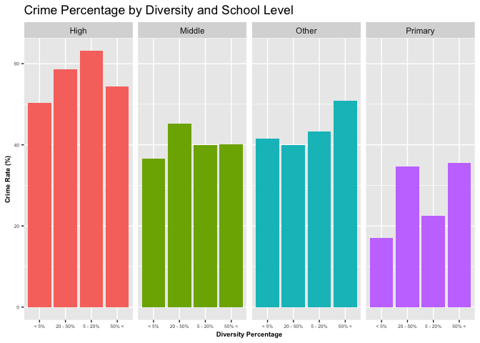<!-- -->

A bar graph of crime percentage by diversity and school level indicate
that high school has the highest crime rate, while primary school has
the lowest crime rate. Also, diversity does not seem to have a
relationship with crime rates. For easier view, school level and
diversity was separately analyzed with their relationship to crime rate:

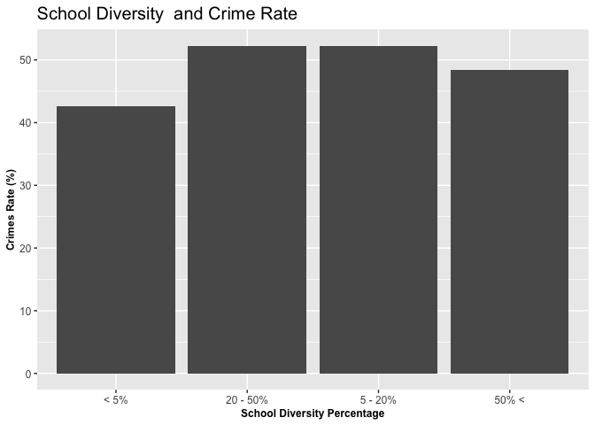<!-- -->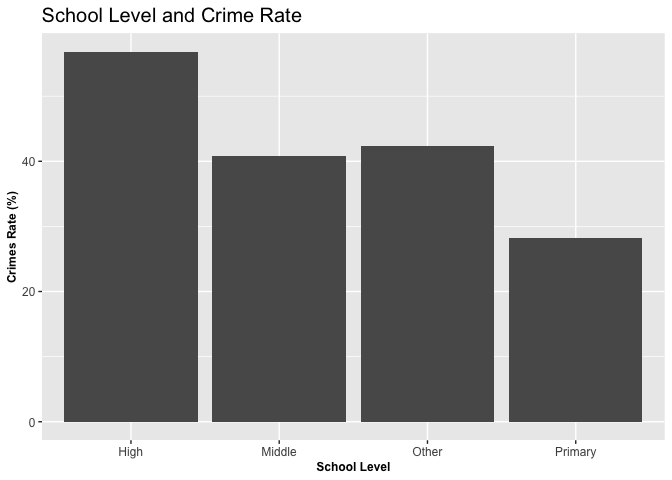<!-- -->

This suggest that out of school environmental variables, the level of
the school is the most statistically significant and biggest factor on
crime rate. Although school diversity does have statistical significance
on school crime rate, it does not have notable difference and
relationship with crime rate. On the other hand, regarding school level,
crime rate is highest in high school and lowest in primary school. High
school has reported over 50% of respondents having observed some sort of
criminal activities at school.

 

### 2.2 Analysis on School Crime vs. School Policies to Ensure Student Safety

##### **Data Preparation**

Values for the variables relating to school policies has been converted
into more readable format for easier analysis.

Again, all criminal activity related variables, which will be dependent
variables, have been combined into one “crimes” variable. These crimes
variables cover crimes relevant to illegal substance, bullying, and
violent crimes (i.e. weapons or gangs). If any of these variables’
values is 1, representing “Yes”, then “crimes” variable will be 1. All
missing values have been replaced to 0 for easier analysis as well.

 

##### **Statistical Data Analysis**

Because the dataset is categorical variables, a logistic regression has
been performed to identify the most significant predictor for crimes.

    ## Warning: glm.fit: fitted probabilities numerically 0 or 1 occurred

    ## 
    ## Call:
    ## glm(formula = crimes ~ SCP_guards + SCP_metal_detector + SCP_visitor_sign + 
    ##     SCP_locker_checks + SCP_badge + SCP_security_camera + SCP_code_of_conduct + 
    ##     SCP_anonymous_report + SCP_fair + SCP_enforced + SCP_clear_punishment + 
    ##     SCP_teacher_respect + SCP_bullying_teacher + SCP_gun_access, 
    ##     family = "binomial", data = crimes_policy_lr)
    ## 
    ## Deviance Residuals: 
    ##     Min       1Q   Median       3Q      Max  
    ## -3.5665   0.0000   0.0000   0.0677   0.9330  
    ## 
    ## Coefficients:
    ##                                                 Estimate Std. Error z value
    ## (Intercept)                                    5.105e+01  1.766e+04   0.003
    ## SCP_guardsNo                                  -5.843e-02  1.147e+04   0.000
    ## SCP_guardsYes                                 -1.926e+01  1.089e+04  -0.002
    ## SCP_metal_detectorNo                          -1.843e+01  7.328e+03  -0.003
    ## SCP_metal_detectorYes                         -1.949e+01  7.328e+03  -0.003
    ## SCP_visitor_signNo                             2.135e+01  6.530e+03   0.003
    ## SCP_visitor_signYes                            9.889e-01  1.711e+00   0.578
    ## SCP_locker_checksNo                            1.212e+00  1.300e+00   0.933
    ## SCP_locker_checksSchool does not have lockers  1.876e+01  6.105e+03   0.003
    ## SCP_locker_checksYes                           1.145e+00  1.103e+00   1.038
    ## SCP_badgeNo                                    2.876e+00  1.569e+00   1.833
    ## SCP_badgeYes                                   3.769e+00  1.971e+00   1.912
    ## SCP_security_cameraNo                         -2.496e+00  1.689e+00  -1.477
    ## SCP_security_cameraYes                         1.408e+00  1.092e+00   1.289
    ## SCP_code_of_conductNo                          2.941e+00  1.610e+04   0.000
    ## SCP_code_of_conductYes                        -1.653e+01  1.182e+04  -0.001
    ## SCP_anonymous_reportNo                         1.745e+01  5.121e+03   0.003
    ## SCP_anonymous_reportYes                        1.801e+00  9.590e-01   1.877
    ## SCP_fairDisagree                               1.845e+01  5.078e+03   0.004
    ## SCP_fairStrongly Agree                         3.749e-01  1.434e+00   0.261
    ## SCP_fairStrongly Disagree                      1.633e+01  1.144e+04   0.001
    ## SCP_enforcedDisagree                           3.843e-01  1.500e+00   0.256
    ## SCP_enforcedStrongly Agree                     1.072e+00  1.586e+00   0.676
    ## SCP_enforcedStrongly Disagree                  1.651e+01  8.743e+03   0.002
    ## SCP_clear_punishmentDisagree                   1.845e+01  4.016e+03   0.005
    ## SCP_clear_punishmentStrongly Agree             5.124e-01  1.441e+00   0.356
    ## SCP_clear_punishmentStrongly Disagree         -1.944e+00  2.089e+00  -0.931
    ## SCP_teacher_respectDisagree                   -3.527e-02  1.521e+00  -0.023
    ## SCP_teacher_respectStrongly Agree              4.284e-01  1.439e+00   0.298
    ## SCP_teacher_respectStrongly Disagree           1.869e+01  1.390e+04   0.001
    ## SCP_bullying_teacherYes                        1.419e-01  9.645e-01   0.147
    ## SCP_gun_accessYes                              1.759e+01  6.808e+03   0.003
    ##                                               Pr(>|z|)  
    ## (Intercept)                                     0.9977  
    ## SCP_guardsNo                                    1.0000  
    ## SCP_guardsYes                                   0.9986  
    ## SCP_metal_detectorNo                            0.9980  
    ## SCP_metal_detectorYes                           0.9979  
    ## SCP_visitor_signNo                              0.9974  
    ## SCP_visitor_signYes                             0.5633  
    ## SCP_locker_checksNo                             0.3510  
    ## SCP_locker_checksSchool does not have lockers   0.9975  
    ## SCP_locker_checksYes                            0.2991  
    ## SCP_badgeNo                                     0.0668 .
    ## SCP_badgeYes                                    0.0559 .
    ## SCP_security_cameraNo                           0.1395  
    ## SCP_security_cameraYes                          0.1974  
    ## SCP_code_of_conductNo                           0.9999  
    ## SCP_code_of_conductYes                          0.9989  
    ## SCP_anonymous_reportNo                          0.9973  
    ## SCP_anonymous_reportYes                         0.0605 .
    ## SCP_fairDisagree                                0.9971  
    ## SCP_fairStrongly Agree                          0.7937  
    ## SCP_fairStrongly Disagree                       0.9989  
    ## SCP_enforcedDisagree                            0.7978  
    ## SCP_enforcedStrongly Agree                      0.4990  
    ## SCP_enforcedStrongly Disagree                   0.9985  
    ## SCP_clear_punishmentDisagree                    0.9963  
    ## SCP_clear_punishmentStrongly Agree              0.7222  
    ## SCP_clear_punishmentStrongly Disagree           0.3521  
    ## SCP_teacher_respectDisagree                     0.9815  
    ## SCP_teacher_respectStrongly Agree               0.7659  
    ## SCP_teacher_respectStrongly Disagree            0.9989  
    ## SCP_bullying_teacherYes                         0.8831  
    ## SCP_gun_accessYes                               0.9979  
    ## ---
    ## Signif. codes:  0 '***' 0.001 '**' 0.01 '*' 0.05 '.' 0.1 ' ' 1
    ## 
    ## (Dispersion parameter for binomial family taken to be 1)
    ## 
    ##     Null deviance: 86.607  on 1254  degrees of freedom
    ## Residual deviance: 51.572  on 1223  degrees of freedom
    ##   (12440 observations deleted due to missingness)
    ## AIC: 115.57
    ## 
    ## Number of Fisher Scoring iterations: 22

The variables related to school policies all had low statistical
significance, higher than confidence level of 0.05. But out of those,
badge and anonymous report are relatively statistically significant.
Therefore, further exploratory data analysis was performed on these
variables to ensure that these two variables indeed do not have
relationship with criminal activities at school. Exploratory data
analysis was performed on badge, which represent whether school requires
students to wear badges or picture identification, and anonymous report,
which represent whether there is a way for anonymous report about a
school crime or threat.

 

##### **Exploratory Data Analysis**

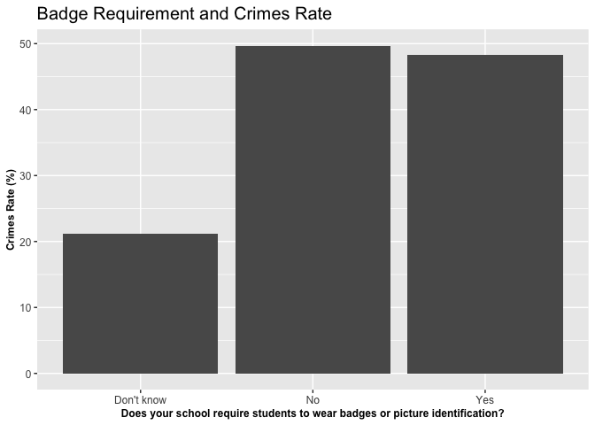<!-- -->

There does not seem to be a relationship between crimes rate and whether
school requires students to wear badges or picture identification. The
crimes rate do not differ much on whether the school requires students
to wear badges/picture identification or not.

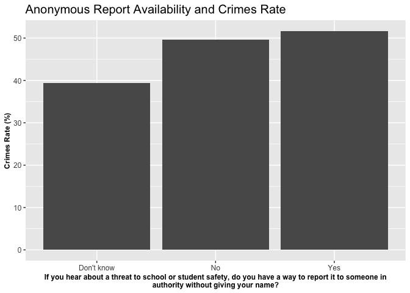<!-- -->

Furthermore, there does not seem to be a relationship between crimes
rate and whether school provides a means for anonymous reporting. The
crimes rate do not differe much on whether the school has a way for
anonymous reporting.   All variables related to school policies did
not have statistical significance and even those with relatively higher
statistical significance do not seem to have relationship with school
crimes rate. Therefore, school policy is not a significant factor for
school crimes in this dataset.

 

### 2.3 Analysis on School Crime vs. Student Characteristics

##### **Data Preparation**

 

##### **Statistical Data Analysis**

    ## 
    ## Call:
    ## glm(formula = crimes ~ ST_race + ST_citizenship + ST_sexual_orientation + 
    ##     ST_gender + ST_cur_gender + ST_spirit_group + ST_performing_arts + 
    ##     ST_academic_club + ST_stugov + ST_community_volunteer + ST_other_club + 
    ##     ST_grades, family = "binomial", data = crimes_student_lr, 
    ##     control = list(maxit = 30))
    ## 
    ## Deviance Residuals: 
    ##     Min       1Q   Median       3Q      Max  
    ## -2.2342  -1.2280   0.8351   1.0424   1.5848  
    ## 
    ## Coefficients:
    ##                                                                                               Estimate
    ## (Intercept)                                                                                  2.005e+00
    ## ST_raceAsian only                                                                           -1.342e+00
    ## ST_raceBlack only                                                                           -1.130e+00
    ## ST_raceBlack-Asian                                                                           1.382e+01
    ## ST_raceBlack-Hawaiian/Pacific IIs                                                            1.432e+01
    ## ST_raceHawaiian/Pacific IS only                                                             -7.057e-01
    ## ST_raceWhite only                                                                           -8.857e-01
    ## ST_raceWhite-Amer Ind                                                                       -2.700e-01
    ## ST_raceWhite-Asian                                                                          -3.583e-01
    ## ST_raceWhite-Black                                                                          -5.066e-01
    ## ST_raceWhite-Black-American Ind                                                             -1.299e+00
    ## ST_raceWhite-Black-Asian                                                                    -1.691e+01
    ## ST_citizenshipYes, born abroad of U.S. citizen parent or parents                             1.373e-01
    ## ST_citizenshipYes, born in Puerto Rico, Guam, the U.S. Virgin Islands, or Northern Marianas  4.747e-01
    ## ST_citizenshipYes, born in the United States                                                 5.723e-01
    ## ST_citizenshipYes, citizen by naturalization                                                 8.205e-01
    ## ST_sexual_orientationI don't know the answer                                                 1.347e+01
    ## ST_sexual_orientationLesbian or gay                                                         -5.253e-01
    ## ST_sexual_orientationSomething else                                                         -1.530e+00
    ## ST_sexual_orientationStraight                                                               -1.584e+00
    ## ST_genderMale                                                                                1.463e+01
    ## ST_genderRefused                                                                             1.575e+01
    ## ST_cur_genderMale                                                                           -1.475e+01
    ## ST_cur_genderNone of these                                                                  -1.489e+01
    ## ST_cur_genderTransgender                                                                    -1.479e+00
    ## ST_spirit_groupYes                                                                          -1.066e-01
    ## ST_performing_artsYes                                                                        3.853e-01
    ## ST_academic_clubYes                                                                          3.629e-01
    ## ST_stugovYes                                                                                -1.640e-01
    ## ST_community_volunteerYes                                                                    3.328e-01
    ## ST_other_clubYes                                                                             3.148e-03
    ## ST_gradesB's                                                                                 1.248e-01
    ## ST_gradesC's                                                                                 3.931e-01
    ## ST_gradesD's                                                                                 1.513e+00
    ## ST_gradesF's                                                                                 1.508e+01
    ##                                                                                             Std. Error
    ## (Intercept)                                                                                  8.659e-01
    ## ST_raceAsian only                                                                            6.881e-01
    ## ST_raceBlack only                                                                            6.678e-01
    ## ST_raceBlack-Asian                                                                           1.455e+03
    ## ST_raceBlack-Hawaiian/Pacific IIs                                                            1.455e+03
    ## ST_raceHawaiian/Pacific IS only                                                              1.102e+00
    ## ST_raceWhite only                                                                            6.591e-01
    ## ST_raceWhite-Amer Ind                                                                        8.812e-01
    ## ST_raceWhite-Asian                                                                           8.852e-01
    ## ST_raceWhite-Black                                                                           7.710e-01
    ## ST_raceWhite-Black-American Ind                                                              1.205e+00
    ## ST_raceWhite-Black-Asian                                                                     1.455e+03
    ## ST_citizenshipYes, born abroad of U.S. citizen parent or parents                             6.081e-01
    ## ST_citizenshipYes, born in Puerto Rico, Guam, the U.S. Virgin Islands, or Northern Marianas  8.117e-01
    ## ST_citizenshipYes, born in the United States                                                 2.318e-01
    ## ST_citizenshipYes, citizen by naturalization                                                 3.863e-01
    ## ST_sexual_orientationI don't know the answer                                                 3.625e+02
    ## ST_sexual_orientationLesbian or gay                                                          7.519e-01
    ## ST_sexual_orientationSomething else                                                          1.094e+00
    ## ST_sexual_orientationStraight                                                                5.112e-01
    ## ST_genderMale                                                                                1.455e+03
    ## ST_genderRefused                                                                             1.455e+03
    ## ST_cur_genderMale                                                                            1.455e+03
    ## ST_cur_genderNone of these                                                                   1.455e+03
    ## ST_cur_genderTransgender                                                                     1.294e+00
    ## ST_spirit_groupYes                                                                           1.616e-01
    ## ST_performing_artsYes                                                                        1.179e-01
    ## ST_academic_clubYes                                                                          1.146e-01
    ## ST_stugovYes                                                                                 1.771e-01
    ## ST_community_volunteerYes                                                                    1.249e-01
    ## ST_other_clubYes                                                                             2.686e-01
    ## ST_gradesB's                                                                                 1.029e-01
    ## ST_gradesC's                                                                                 1.529e-01
    ## ST_gradesD's                                                                                 5.664e-01
    ## ST_gradesF's                                                                                 5.144e+02
    ##                                                                                             z value
    ## (Intercept)                                                                                   2.315
    ## ST_raceAsian only                                                                            -1.950
    ## ST_raceBlack only                                                                            -1.692
    ## ST_raceBlack-Asian                                                                            0.009
    ## ST_raceBlack-Hawaiian/Pacific IIs                                                             0.010
    ## ST_raceHawaiian/Pacific IS only                                                              -0.640
    ## ST_raceWhite only                                                                            -1.344
    ## ST_raceWhite-Amer Ind                                                                        -0.306
    ## ST_raceWhite-Asian                                                                           -0.405
    ## ST_raceWhite-Black                                                                           -0.657
    ## ST_raceWhite-Black-American Ind                                                              -1.078
    ## ST_raceWhite-Black-Asian                                                                     -0.012
    ## ST_citizenshipYes, born abroad of U.S. citizen parent or parents                              0.226
    ## ST_citizenshipYes, born in Puerto Rico, Guam, the U.S. Virgin Islands, or Northern Marianas   0.585
    ## ST_citizenshipYes, born in the United States                                                  2.469
    ## ST_citizenshipYes, citizen by naturalization                                                  2.124
    ## ST_sexual_orientationI don't know the answer                                                  0.037
    ## ST_sexual_orientationLesbian or gay                                                          -0.699
    ## ST_sexual_orientationSomething else                                                          -1.398
    ## ST_sexual_orientationStraight                                                                -3.099
    ## ST_genderMale                                                                                 0.010
    ## ST_genderRefused                                                                              0.011
    ## ST_cur_genderMale                                                                            -0.010
    ## ST_cur_genderNone of these                                                                   -0.010
    ## ST_cur_genderTransgender                                                                     -1.143
    ## ST_spirit_groupYes                                                                           -0.660
    ## ST_performing_artsYes                                                                         3.269
    ## ST_academic_clubYes                                                                           3.167
    ## ST_stugovYes                                                                                 -0.926
    ## ST_community_volunteerYes                                                                     2.665
    ## ST_other_clubYes                                                                              0.012
    ## ST_gradesB's                                                                                  1.212
    ## ST_gradesC's                                                                                  2.571
    ## ST_gradesD's                                                                                  2.671
    ## ST_gradesF's                                                                                  0.029
    ##                                                                                             Pr(>|z|)
    ## (Intercept)                                                                                  0.02059
    ## ST_raceAsian only                                                                            0.05120
    ## ST_raceBlack only                                                                            0.09068
    ## ST_raceBlack-Asian                                                                           0.99243
    ## ST_raceBlack-Hawaiian/Pacific IIs                                                            0.99215
    ## ST_raceHawaiian/Pacific IS only                                                              0.52204
    ## ST_raceWhite only                                                                            0.17899
    ## ST_raceWhite-Amer Ind                                                                        0.75931
    ## ST_raceWhite-Asian                                                                           0.68564
    ## ST_raceWhite-Black                                                                           0.51114
    ## ST_raceWhite-Black-American Ind                                                              0.28084
    ## ST_raceWhite-Black-Asian                                                                     0.99073
    ## ST_citizenshipYes, born abroad of U.S. citizen parent or parents                             0.82142
    ## ST_citizenshipYes, born in Puerto Rico, Guam, the U.S. Virgin Islands, or Northern Marianas  0.55870
    ## ST_citizenshipYes, born in the United States                                                 0.01355
    ## ST_citizenshipYes, citizen by naturalization                                                 0.03364
    ## ST_sexual_orientationI don't know the answer                                                 0.97037
    ## ST_sexual_orientationLesbian or gay                                                          0.48480
    ## ST_sexual_orientationSomething else                                                          0.16203
    ## ST_sexual_orientationStraight                                                                0.00194
    ## ST_genderMale                                                                                0.99198
    ## ST_genderRefused                                                                             0.99137
    ## ST_cur_genderMale                                                                            0.99191
    ## ST_cur_genderNone of these                                                                   0.99184
    ## ST_cur_genderTransgender                                                                     0.25284
    ## ST_spirit_groupYes                                                                           0.50940
    ## ST_performing_artsYes                                                                        0.00108
    ## ST_academic_clubYes                                                                          0.00154
    ## ST_stugovYes                                                                                 0.35429
    ## ST_community_volunteerYes                                                                    0.00769
    ## ST_other_clubYes                                                                             0.99065
    ## ST_gradesB's                                                                                 0.22553
    ## ST_gradesC's                                                                                 0.01014
    ## ST_gradesD's                                                                                 0.00756
    ## ST_gradesF's                                                                                 0.97662
    ##                                                                                               
    ## (Intercept)                                                                                 * 
    ## ST_raceAsian only                                                                           . 
    ## ST_raceBlack only                                                                           . 
    ## ST_raceBlack-Asian                                                                            
    ## ST_raceBlack-Hawaiian/Pacific IIs                                                             
    ## ST_raceHawaiian/Pacific IS only                                                               
    ## ST_raceWhite only                                                                             
    ## ST_raceWhite-Amer Ind                                                                         
    ## ST_raceWhite-Asian                                                                            
    ## ST_raceWhite-Black                                                                            
    ## ST_raceWhite-Black-American Ind                                                               
    ## ST_raceWhite-Black-Asian                                                                      
    ## ST_citizenshipYes, born abroad of U.S. citizen parent or parents                              
    ## ST_citizenshipYes, born in Puerto Rico, Guam, the U.S. Virgin Islands, or Northern Marianas   
    ## ST_citizenshipYes, born in the United States                                                * 
    ## ST_citizenshipYes, citizen by naturalization                                                * 
    ## ST_sexual_orientationI don't know the answer                                                  
    ## ST_sexual_orientationLesbian or gay                                                           
    ## ST_sexual_orientationSomething else                                                           
    ## ST_sexual_orientationStraight                                                               **
    ## ST_genderMale                                                                                 
    ## ST_genderRefused                                                                              
    ## ST_cur_genderMale                                                                             
    ## ST_cur_genderNone of these                                                                    
    ## ST_cur_genderTransgender                                                                      
    ## ST_spirit_groupYes                                                                            
    ## ST_performing_artsYes                                                                       **
    ## ST_academic_clubYes                                                                         **
    ## ST_stugovYes                                                                                  
    ## ST_community_volunteerYes                                                                   **
    ## ST_other_clubYes                                                                              
    ## ST_gradesB's                                                                                  
    ## ST_gradesC's                                                                                * 
    ## ST_gradesD's                                                                                **
    ## ST_gradesF's                                                                                  
    ## ---
    ## Signif. codes:  0 '***' 0.001 '**' 0.01 '*' 0.05 '.' 0.1 ' ' 1
    ## 
    ## (Dispersion parameter for binomial family taken to be 1)
    ## 
    ##     Null deviance: 2907.9  on 2149  degrees of freedom
    ## Residual deviance: 2787.1  on 2115  degrees of freedom
    ##   (11545 observations deleted due to missingness)
    ## AIC: 2857.1
    ## 
    ## Number of Fisher Scoring iterations: 14

Although there were no variables that showed statistical significance
across all categorical options, there were variables that showed
relatively higher statistical significance across some options. The p
values of the variables related to student characteristics indicate
statistical significance lower than 0.05 confidence level for student
grades, extracurricular participation (most specifically,
ST\_community\_volunteerYES, ST\_academic\_clubYes,
ST\_performing\_artsYes), and sexual orientation. Therefore, further
exploratory data analysis on these variables have been performed.

 

##### **Exploratory Data Analysis**

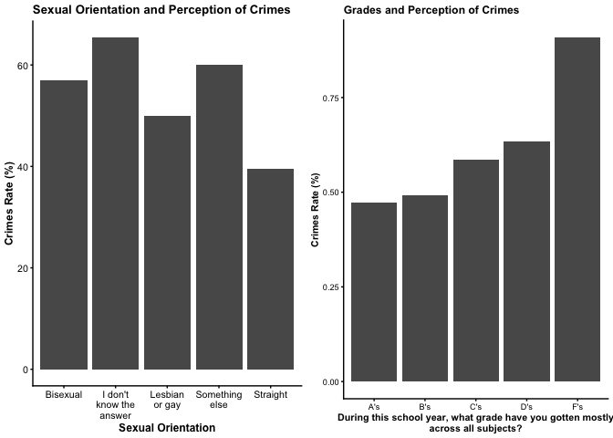<!-- -->

Students who identified their sexual orientation as straight seemed to
perceive school crimes as lower than those that did not. Also, students
who have reported to have received mostly F’s seemed to perceive school
crimes as higher than those who received other grades. A possible reason
for this is that students who do not identify as straight could have
been more likely to become victims of school crimes than those who did,
and thus increasing their awareness of school crimes. Further, students
who are involved with school crimes, either as inflictor or as victim,
would have likely had their grades affected as well.

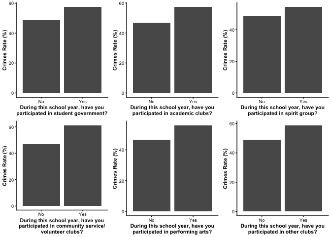<!-- -->

The exploratory data analysis on students’ participation of
extracurricular activities indicate that those who participated in
extracurricular clubs perceive school crimes rate as slightly higher
than those who did not. A possible reason could be that students who
participate in clubs have greater interaction with other students, which
could have increased their awareness of school crimes.

 

## **3. Analysis on School Crime and Its Impact on Students**

In this section, the school crime is independent variable and different
impact that students received are dependent variables. It aims to
analyze if existence of criminal activities at school have a significant
impact on students in areas such as their self-perception of future
prospects, mental health, and other personal influence.

 

The impact of school crimes have been grouped into 2 areas: impact on 1)
their future prospects and 2) mental health. Only the data of students
who responded to have observed any sort of criminal activities, have
been extracted to see more clearly what the impacts are. Variables
relevant to each areas have been extracted.

 

##### **Exploratory Data Analysis - Future Prospects**

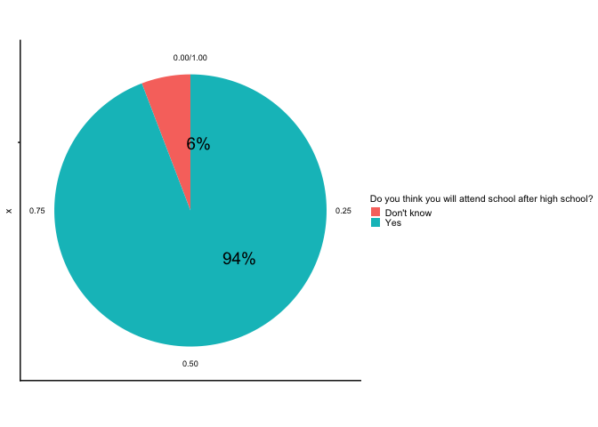<!-- -->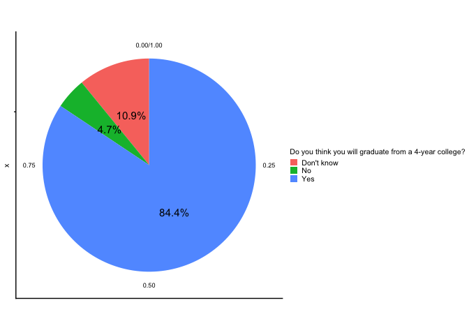<!-- -->

This pie chart indicates that out of those survey respondents who
responded to have observed any sort of criminal activities at school,
94% thinks that they will attend school after high school and 84.4%
thinks that they will graduate from a 4-year college. Therefore,
although their school may have incidents of criminal activities, this
does not seem to have a relationship with students’ future prospects.

 

##### **Exploratory Data Analysis - Mental health**

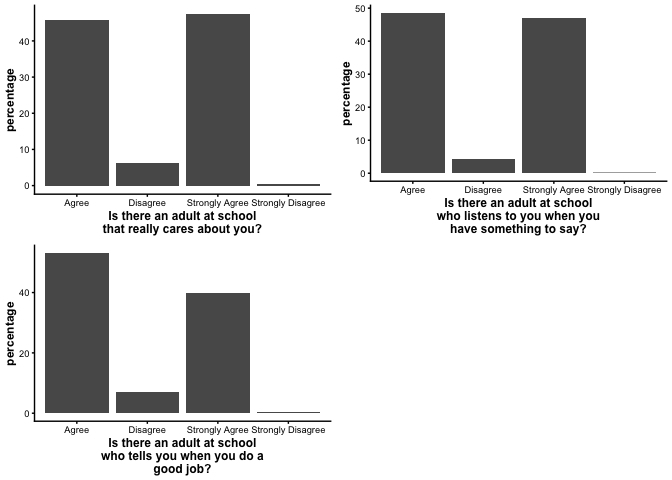<!-- -->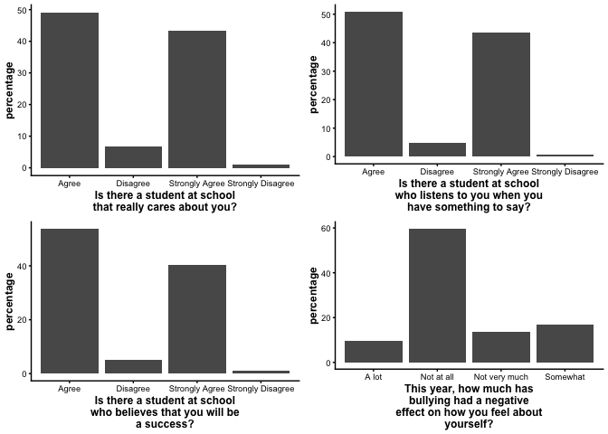<!-- -->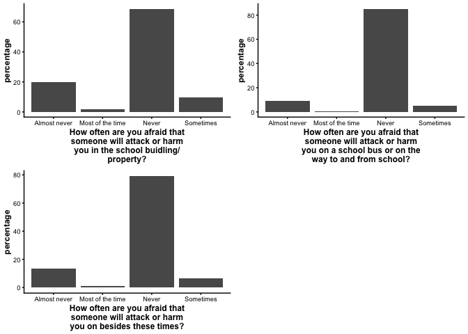<!-- -->

Out of those survey respondents who responded to have observed any sort
of criminal activities at school, most of them did not answer that
exhibit concern for their mental health. A large majority of them showed
positive responses to questions that relate to students’ self-esteem or
perception of safety. Therefore, this conveys that even if a school may
have incidents of criminal activities, this does not seem to have a
significant relationship with students’ mental health.

 

## **4. Conclusion and Future Actions**

My hypothesis was that all 3 factors (school environment, school
policies, and student characteristics) would have a relationship with
crime rate at school. However, different school policies to ensure
student safety or regulate criminal activities did not seem to have
relationship with crimes rate based on statistical and exploratory data
analysis.

The results indicate that for school environment, school level has the
most statistically significant and greatest impact on school crimes
rate, with high school having highest crime rate. For student
characteristics, students’ sexual orientation and grades seemed to have
relationship with their perception of criminal activities. Students who
did not identify themselves as straight and students with lower grades
observed more crimes. Students’ participation of extracurricular clubs
also had a slight relationship with crimes rate, with students who were
more actively participated in clubs observed more crimes.

Moreover, I predicted that school crime would have significant impact on
students’ future prospects and their mental health. However,
surprisingly, school crimes do not raise significant concern for
students’ future prospects or their mental health.

However, these results suggest that the impact of school crimes may be
concentrated on the victims. Students who identified themselves as part
of the LGBTQ community seemed to have observed higher rate of criminal
activities. Also, there was a small portion of survey respondents whose
future prospects and mental helath have been negatively impacted by
school crimes. Therefore, further study focused on the minority and
potential victims should be conducted.
